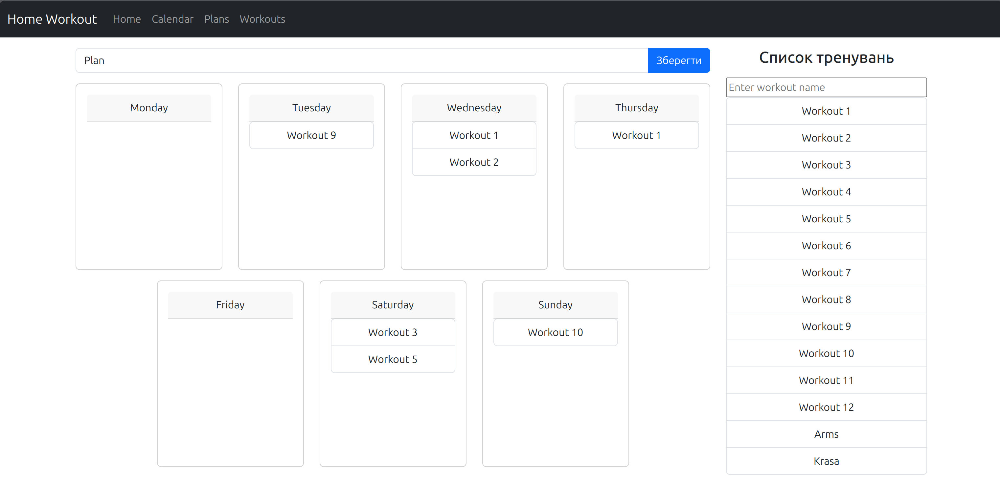
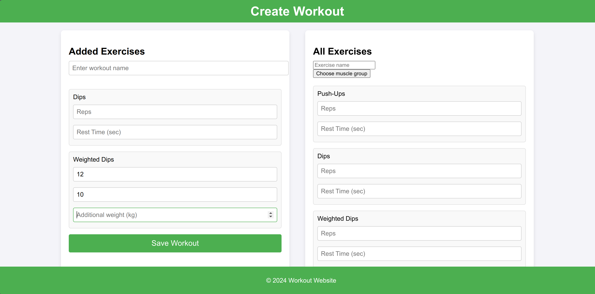

# WorkoutSite

A Flask web application for planning and tracking gym/fitness workouts. You build
personal workouts from an exercise library, then arrange them into a weekly training
plan with a drag-and-drop calendar.

## Screenshots

**Weekly plan builder** — drag workouts onto days of the week:



**Workout builder** — assemble a workout from the exercise library:



## Features

**Exercise library**
- Pre-seeded database of exercises, each with a name, difficulty level, targeted
  muscle groups, and whether it requires additional weight (e.g. dumbbells).
- Search exercises by name or filter by muscle group.

**Workout builder** (`/workouts/create`)
- Pick exercises from the library and assemble them into a named workout.
- Set per-exercise parameters: reps, rest time, additional weight, and order.
- Save the workout to the database.

**Weekly plan builder** (`/plans/create`)
- Arrange saved workouts across a 7-day calendar (Mon–Sun) using drag-and-drop.
- Assign multiple workouts per day, with ordering.
- Name and save the plan; existing plans can be edited.

**Plan viewer** (`/plans/`)
- View the full weekly plan in a calendar layout and see which workouts are
  scheduled for each day.

> A guided training-session view (`/training`) — walking through a workout exercise
> by exercise — is in progress.

## Tech Stack

- **Backend:** Python, Flask, SQLAlchemy ORM, Flask-Migrate
- **Database:** SQLite
- **Frontend:** Jinja2 templates, Bootstrap, vanilla JavaScript (modular per feature),
  drag-and-drop via the HTML Drag and Drop API

## Getting Started

1. Clone the repository and create a virtual environment:
   ```bash
   git clone https://github.com/pierDenu/WorkoutSite.git
   cd WorkoutSite
   python -m venv .venv
   source .venv/bin/activate
   pip install -r requirements.txt
   ```

2. Set up environment variables:
   ```bash
   cp .env.example .env
   # Edit .env and set a real SECRET_KEY
   ```

3. Apply database migrations:
   ```bash
   flask --app app.run db upgrade
   ```

4. Seed the database with exercises:
   ```bash
   python app/scripts/seed_exercises.py
   ```

5. Run the development server:
   ```bash
   python run.py
   ```

The app will be available at `http://localhost:5000`.

## Project Structure

```
WorkoutSite/
├── app/
│   ├── models/             # SQLAlchemy models (exercises, workouts, plans)
│   ├── routes/             # Flask blueprints (workouts, plans, training)
│   ├── templates/          # Jinja2 templates
│   ├── static/             # CSS, JavaScript (per-feature modules)
│   └── scripts/
│       └── seed_exercises.py
├── migrations/             # Flask-Migrate / Alembic migrations
├── config.py
├── run.py
└── requirements.txt
```